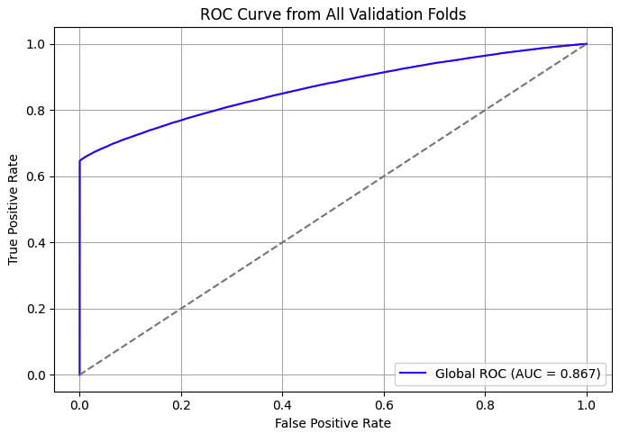

# 🚗 Car Insurance Claim Prediction with XGBoost

Predicting whether a driver will file a car insurance claim based on demographic, vehicle, and behavioral data. This project involves a full ML pipeline: from preprocessing and feature engineering to model tuning and business-oriented risk stratification.

---

## 📚 Table of Contents

- [🌟 Project Overview](#-project-overview)
- [📊 Dataset Overview](#-dataset-overview)
- [📦 Project Phases & To-Do List](#-project-phases--to-do-list)
- [🧹 Data Cleaning](#-data-cleaning)
- [📌 Exploratory Data Analysis (EDA)](#-exploratory-data-analysis-eda)
- [🧩 Feature Engineering & Selection](#-feature-engineering--selection)
- 
- [🌟 Final Deliverables](#-final-deliverables)
- [📊 Results Summary](#-results-summary)
- [📈 Model Evaluation & Business Interpretation](#-model-evaluation--business-interpretation)


- [🌟 Project Overview](#-project-overview)
- [📊 Dataset Overview](#-dataset-overview)
- [🚀 Quick Start](#-quick-start)
- [🧩 Feature Groups](#-feature-groups)
- [📦 Project Phases & To-Do List](#-project-phases--to-do-list)
- [🌟 Final Deliverables](#-final-deliverables)
- [📊 Results Summary](#-results-summary)
- [📈 Model Evaluation & Business Interpretation](#model-evaluation--business-interpretation)
- [📦 Tech Stack](#-tech-stack)
- [📁 Project Structure](#-project-structure)
- [🚫 Notes](#-notes)
- [📄 License & Contribution](#-license--contribution)

---

## 🌟 Project Overview

### Backgorund:

In recent years, Tesla's intelligent systems and high performance have gained significant market traction. However, some models such as **Model Y and Cybertruck exhibit elevated claim frequencies and costs**, attracting attention from insurers and regulators. These trends are driven by:
- High repair costs associated with intelligent systems
- Complex Autopilot-related accident factors
- Heterogeneous driver behaviors and vehicle usage scenarios

**This poses increased underwriting and payout risks for insurers**. The project proposes building a **machine learning-based dynamic risk prediction model** to modernize the traditional actuarial approach, leveraging data-driven modeling to quantify risk more accurately.

### Objective:

1. Identify high-risk vehicle models, driving behavior patterns and predict the likelihood of claims over a defined period.
2. Provide quantitative basis for dynamic pricing and risk stratification.

### Business Applications:

💰 Risk-based Premium Adjustment
Adjust insurance pricing based on predicted claim probabilities

🛡️ Tailored Underwriting Rules
Define acceptance thresholds or policy conditions based on risk profiles

🚘 Proactive Behavioral Interventions
Identify high-risk drivers early and offer training, incentives, or personalized feedback to reduce claim likelihood

---

## 📊 Dataset Overview

**400,000+** training data, **600,000+** testing data for prediction.

The dataset contains rich, multi-dimensional features covering **driver profiles**, **vehicle specifications**, **regional context**, and **driving behavior**, structured as follows:

### 🧍 Individual Features (`ps_ind_*`)

| Feature         | Description |
|----------------|-------------|
| `ps_ind_01`     | Driver age group (ordered, e.g., 18–25, 26–35...) |
| `ps_ind_02_cat` | License type (categorical: C1, C2, A2, etc.) |
| `ps_ind_03`     | Driving experience (years) |
| `ps_ind_04_cat` | Occupation risk level (e.g., white-collar, high-risk) |
| `ps_ind_06_bin` | Prior accident history (0 = No, 1 = Yes) |
| `ps_ind_07_bin` | Has Tesla dashcam installed (0/1) |
| `ps_ind_16_bin` | Participated in Tesla safe driving training (0/1) |

---

### 🚗 Vehicle Features (`ps_car_*`)

| Feature         | Description |
|----------------|-------------|
| `ps_car_01_cat` | Vehicle model (e.g., Model 3, Y, S, X) |
| `ps_car_03_cat` | Battery type (e.g., LFP, NCM/NCA) |
| `ps_car_05_cat` | Charging method (home charger, Supercharger, 3rd-party) |
| `ps_car_11_cat` | Battery health score (0–100) |
| `ps_car_12`     | Avg. charging time per session (hours) |
| `ps_car_15`     | Autopilot usage frequency (avg. daily minutes) |

---

### 🌍 Regional Features (`ps_reg_*`)

| Feature         | Description |
|----------------|-------------|
| `ps_reg_01`     | Climate risk index of the registered location (e.g., high rain/snow) |
| `ps_reg_02`     | Traffic congestion index (continuous) |
| `ps_reg_03`     | EV charging station density (chargers per km²) |

---

### 🛣️ Driving Behavior Features (`ps_calc_*`)

| Feature         | Description |
|----------------|-------------|
| `ps_calc_01`     | Aggressive driving score (frequency of harsh braking/acceleration) |
| `ps_calc_04`     | Nighttime driving ratio (share of total driving time) |
| `ps_calc_10`     | Long-distance trip frequency (e.g., monthly trips >300km) |
| `ps_calc_15_bin` | Sentry Mode enabled (0/1) |

---

## 🧩 Feature Groups

To streamline feature engineering and modeling, the dataset was grouped into logical feature domains:

- **Individual Attributes**: age, license type, driving history  
- **Vehicle Characteristics**: model, battery type, charging habits, Autopilot usage  
- **Regional Attributes**: environmental and infrastructure context  
- **Behavioral Indicators**: aggressive driving patterns, night driving, sentry mode  
- **Interaction Features**: engineered terms such as `vehicle × region`, `driver × behavior`, `model × usage`

### 🛠 Feature Processing Techniques

- **Encoding**
  - One-Hot Encoding for low-cardinality categorical variables
  - Target Encoding for high-cardinality categorical features
- **Variance & Correlation Filtering**
  - Removed low-variance features
  - Visualized pairwise correlations to mitigate multicollinearity
- **Feature Selection**
  - Used shallow XGBoost with strong regularization (high λ, γ) to filter weak predictors
  - Selected features with both **gain** and **weight** above the median
- **Interaction Construction**
  - Combined behavioral and regional attributes to capture localized usage risks  
  - Example: `Autopilot usage × region congestion level`

---

## 🚀 Quick Start

To get started quickly, follow these steps:


#### 1. Clone the repository

```bash
git clone https://github.com/Feiyingdai/Car-Insurance-Claim-Prediction.git
cd Car-Insurance-Claim-Prediction
```


#### 2. Install required packages

```bash
pip install -r requirements.txt
```

Or install manually:

```bash
pip install pandas numpy scikit-learn xgboost optuna shap matplotlib seaborn
```

#### 3. Run the notebook

Open the notebook using Jupyter or Colab:

```bash
jupyter notebook notebooks/car_insurance_claim_prediction.ipynb
```


#### 4. Use the sample dataset

A small sample dataset `sample_data.csv` (100 rows) is included in the `data/` folder for testing and quick experimentation.

```python
# Load sample data
import pandas as pd
df = pd.read_csv('data/sample_data.csv')
df.head()
```
---

## 📦 Project Phases & To-Do List

### ✅ Completed

- [x] Dataset understanding and schema review
- [x] Data cleaning and type formatting
- [x] Exploratory data analysis (EDA)
- [x] Feature engineering and interaction terms
- [x] Feature selection via regularized XGBoost
- [x] Imbalance handling (SMOTE / iterative undersampling / scale_pos_weight)
- [x] Model training with XGBoost
- [x] Optuna-based hyperparameter tuning (10-fold CV)
- [x] Threshold optimization for risk segmentation
- [x] SHAP-based model interpretation
- [x] Business Insights

### 📝 To-Do (Potential Future Work)

- [ ] Compare other models (e.g., Logistic Regression, LightGBM)
- [ ] Model ensemble and stacking
---

### 🌟 Final Deliverables

| Deliverable        | Description                                           |
|--------------------|-------------------------------------------------------|
| Trained Model      | XGBoost model with tuned hyperparameters             |
| Feature Set        | Finalized engineered feature matrix                  |
| Evaluation         | AUC Score, ROC Curve, KS score, Recall              |
| Prediction         | Out-of-sample prediction on test dataset             |


---

### 📊 Results Summary

| Metric                     | Result     |
|----------------------------|------------|
| AUC                        | 0.86       |
| High-Risk Driver Recall    | 65%        |
| KS Score                   | 0.64       |

---

### Model Evaluation & Business Interpretation

**1. 📈 Cross-Validation Results (10 Folds)**

| Fold | AUC   |
|------|-------|
| 1    | 0.8651 |
| 2    | 0.8652 |
| 3    | 0.8659|
| 4    | 0.8685 |
| 5    | 0.8767|
| 6    | 0.8669 |
| 7    | 0.8670|
| 8    | 0.8669 |
| 9    | 0.8619 |
| 10   | 0.8638 |
| **Avg** | **0.8666** |

**KS Score (avg):** 0.64  
**Recall at KS Threshold (avg):** 0.65

**2. 📈 ROC Curve**

Model performance across validation folds:



   
**3. 📌 Business Interpretation**

By stratifying drivers based on optimal threshold (KS=0.64), we can segment the population into low-risk and high-risk groups, enabling targeted actions across pricing, underwriting, and behavioral strategies:

**🔎 Risk-Based Premium Adjustment**

- **High-risk drivers**  
  - Apply surcharges  
  - Remove discounts such as loss-free bonus  

- **Low-risk drivers**  
  - Offer loyalty-based incentives (e.g., premium rebates or safe-driving discounts)

**🧾 Tailored Underwriting Rules**

- **High-risk drivers**  
  - Set higher deductibles  
  - Cap maximum coverage limits  
  - Require telematics device installation for behavior monitoring

- **Low-risk drivers**  
  - Enable instant policy approval  
  - Minimize documentation requirements

**🚦 Proactive Behavioral Interventions**

- **High-risk drivers**  
  - Recommend incentivized defensive driving courses  
  - Provide monthly updated risk score summaries  
  - Send personalized safe-driving reminders via email or app notifications

These measures not only improve portfolio profitability but also contribute to long-term risk reduction by encouraging safer driving behavior.

---

### 📦 Tech Stack

Language: Python 3.10+

Modeling: XGBoost 1.7+

Tuning: Optuna 3.0+

Libraries: pandas, scikit-learn, seaborn, matplotlib

---

### 📁 Project Structure

```
.
├── data/                   # Raw and processed datasets (not uploaded)
├── notebooks/              # Modeling and feature engineering notebooks
├── image/                  # Images for modeling output
├── README.md               # Project documentation
└── requirements.txt        # Dependency list
```

---

### 🚫 Notes

Dataset not uploaded due to privacy constraints.

A small sample dataset **sample_data.csv** is available in data/ folder for reproducibility.

---

### 📄 License & Contribution

**📝 License**

MIT License

**👥 Contributors**

This project was developed by Feiying Dai, as part of my personal portfolio to demonstrate risk modeling in real-world insurance applications.

